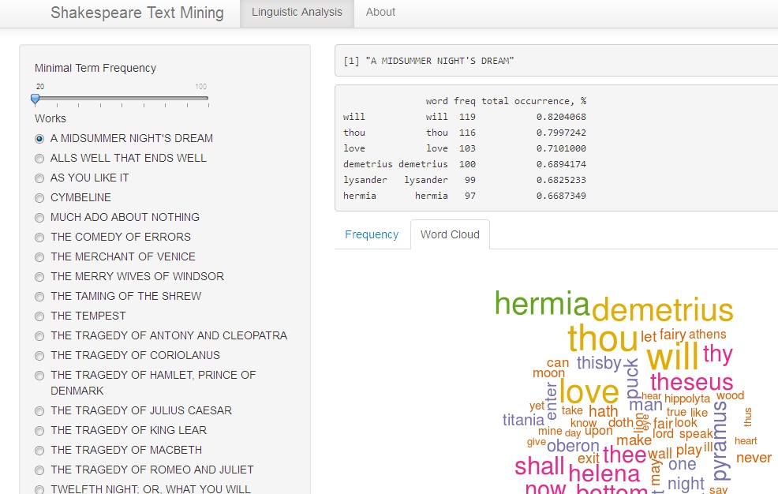

## Text Mining in Data Science

One of the important topic in the Data science area is the **Text Mining**. 

Some examples of Text Mining:

1. Extracting Product Features and Opinions from Reviews published on Internet

2. Extracting Relations from Text

3. Identifying Text-Types to Measure the Cohesion of Text Structures

4. Automatic Document Separation

### Important related techniques:

- Natural Language Processing

- Quantitative Linguistics


---

## Shakespeare Text Mining

This application is based on the *Project Gutenberg* library containing complete works of William Shakespeare. App uses only some of the Shakespeare's work and contains most simple operation in the Text Mining domains for demonstration purposes.
### Features:

- Calculation of most frequent terms in a selected document.

- Plotting of term's frequency histogram

- Visualisation in a Word Cloud format

- Tenable minimal frequency tolerance

- Customizable **Word Cloud** plots allows selection between Black/White and Color mode

- Automatic plots update on document selection during document context switch

- User documentation

---


## Application view 

Application link: <a href="http://zhuchel.shinyapps.io/DevelopDataProducts"> Shakespeare Text Mining</a> 

  


--- .codefont 


## Document Term Matrix


```r
library(tm)
text <- readLines(paste0("texts/", "A MIDSUMMER NIGHT'S DREAM.txt"),encoding="UTF-8")
docs <- VCorpus(VectorSource(text))
docs <- tm_map(docs, tolower)       # to lower case
docs <- tm_map(docs, removeNumbers) # remove numbers
docs <- tm_map(docs, removePunctuation) # remove punctuation
docs <- tm_map(docs, removeWords, stopwords("english")) # remove stop words
docs <- tm_map(docs, stripWhitespace)
docs <- tm_map(docs, PlainTextDocument)
dtm <- DocumentTermMatrix(docs)  
freq <- sort(colSums(as.matrix(dtm)), decreasing=TRUE) 
wf <- data.frame(word=names(freq), freq=freq)
wf1 <- cbind(wf, wf$freq / nTerms(dtm) * 100)
colnames(wf1) <- c("word", "freq", "total occurrence, %")
head(wf1)  
```

```
##                word freq total occurrence, %
## will           will  119               4.102
## thou           thou  116               3.999
## love           love  103               3.550
## demetrius demetrius  100               3.447
## lysander   lysander   99               3.413
## hermia       hermia   97               3.344
```


